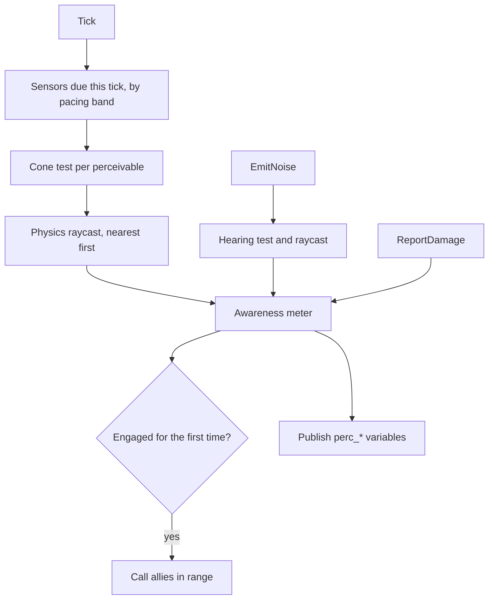

# Perception (GOAT_Perception)

> **Status:** Implemented, not yet run in a level
> **Gem:** `GOAT_Perception`
> **Folder:** `Modules/Perception/`

---

## What it is

Senses for GOAT agents. A `.prx` profile describes what an agent can see and hear and how quickly it
notices. The module senses for every agent that carries the **GOAT Perception** component and
publishes the result to the agent's blackboard, where [[GuardWatch]] already watches it.

| Profile section | Holds |
| :--- | :--- |
| Sight | A cone each for idle, alert and combat: range, horizontal and vertical angle, back offset; a darkness scale (stored, not yet used); the physics groups that block sight |
| Hearing | Range, wall muffling, minimum loudness |
| Proximity | Range at which anything is noticed regardless of facing, walls or light |
| Awareness | Thresholds for Suspicious, Searching and Engaged, how fast the meter drains and whether it drains smoothly or in steps, the distance that skips to Engaged, how fast sight and sound fill it |
| Memory | Seconds each state lasts without a fresh stimulus, and how long a heard sound is remembered |
| Targets | Tags that count as something to notice, awareness gained from a hit |
| Calling for help | Radius, squad, reply delay and jitter |
| Cost | Seconds between sight checks |

---

## Setting up

1. Enable `GOAT_Perception`.
2. In the Asset Editor, **File > New > GOAT > Perception**, and save a `.prx`.
3. Add **GOAT Perception** to the agent entity and pick the profile; none picked uses the defaults.
4. Add **GOAT Perceivable** to whatever should be noticed, with a tag such as `player`.

`PerceptionProfileAsset::Validate()` names the first value sensing could not use. The component logs
it as a warning when a profile loads.

---

## What it publishes

Agent-scoped, declared by the module.

| Variable | Type | Meaning |
| :--- | :--- | :--- |
| `perc_state` | Int | 0 Unaware, 1 Suspicious, 2 Searching, 3 Engaged |
| `perc_target` | EntityId | What the agent is aware of, set only once it is at least Suspicious |
| `perc_target_visible` | Bool | In sight right now |
| `perc_last_known` | Vector3 | Where the target was last sensed |
| `perc_heard` | Bool | True from a sound until the sound memory runs out |
| `perc_noise_pos` | Vector3 | Where the last heard sound came from |
| `perc_awareness` | Float | The meter, 0 to Engaged At |

Writes are throttled so a quiet agent does not wake guards: last known in half-metre steps,
awareness in tenths of the ceiling.

---

## How a pass works

- Sensors are checked every **Sense Interval** seconds, multiplied by one plus the agent's pacing
  band, so far agents cost less ([[AgentRegistry]]).
- A target is only raycast when the cheap cone test passes, and nearest first.
- A sensor stops at the first target with a clear line, so a crowd in the cone costs one ray, not one each.
- Rays are capped per frame by the `goat_perceptionRayBudget` cvar (default 64, 0 is unlimited). Sensors over
  the cap wait for the next frame, most overdue first. A sensor can overshoot by the rays of its own pass.
- A new sensor's first look is spread randomly across one interval, so sensors made together do not all fire at once.
- Hearing is evaluated when the sound is made, not on a pass.
- Allies told to engage do not call for help in turn.

---

## Limits

- **Walls and sound.** A blocked line stands in for a wall and costs the wall cut once, however many
  walls are really in the way.
- **What blocks a view.** With the profile's blocker mask at zero, only static world geometry does, so characters, their weapons and anything carried by them never hide each other. With groups chosen, shapes in those groups block on any kind of body. Either way the sensor's own shapes, the target's, and shapes that collide with nothing (an empty collision group mask, as hurtboxes use) are skipped.
- **Diagnosing a blind sensor.** The log (category `GOAT_Perception`) says when a sensor and a perceivable register, when sensors are looking with no perceivable placed, and every three seconds when a sensor has something in its view cone that it cannot see, naming what is in the way.
- **Darkness** is not implemented.
- **Hot reloading a profile** restarts that agent's awareness.
- **One target.** `perc_target` is the nearest sighted one.

---

## Related

- [[Perception Params Asset]]
- [[Perception Module]]
- [[Animation Signal Hook]]
- [[BlackboardAsset]]

---

*Last updated: 2026-10-03*
