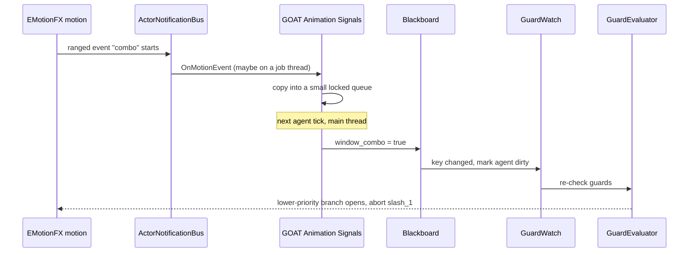

# Animation Signal Hook

> **Status:** Built (2026-10-03), not yet compiled or run in a level. This note is the original design; [[Animation]] describes what exists
> **Home:** `Modules/Animation/` (`GOAT_Animation`)
> **Direction:** animation **to** AI. The `animate` verb already goes the other way.

What changed from the design below:

- **Minimum weight** is one setting on the component, not one per binding.
- **Closing windows when the agent's action ends** is not built. The core publishes no notification for an action ending, so a window closes only by its end event, its *Max seconds*, or the component deactivating.
- **A one-shot event and the start of a ranged event look the same** to EMotionFX (`m_isEventStart` is true for both), so whether a binding is a window or a pulse is the binding's setting.
- **A pulse holds for a quarter of a second**, not one tick, so an agent in a slow pacing band still sees it.
- **`combo_ready` is written by the module.** Open question 1 below was settled with its first option: a binding has an optional *Ready variable* and an *Also require* list, and the component keeps the ready variable equal to the window AND every required agent Bool (`!name` means false). It re-reads the required variables each frame while the window is open, so the latency is a frame, and it needs no core change.
- The component **requires the Actor service** on its entity, and declares each binding's variable in `Init`, before the agent's tree compiles.

---

## 🎯 Objective

Let an **animation open a decision window** for the AI. The animator decides *when* the
AI may branch, and the AI decides *whether* it does. Neither has to count frames.

GOAT can already express the AI half of that with no core change:

- A `condition` with `abort = "lower_priority"` re-evaluates when its blackboard key changes
  ([[GuardEvaluator]]) and restarts the walk at its branch.
- `IAgentSystem::WakeAgents` wakes an agent whose action is waiting on `WakeWhen::OnSignal`.

What is missing is the **producer**: something that turns an animation event into a blackboard
write. That is all this hook is.

---

## 🧩 The source: EMotionFX motion events

EMotionFX already publishes them. From `Include/Integration/AnimationBus.h`:

```cpp
EMotionFX::Integration::ActorNotificationBus   // addressed by entity id
    virtual void OnMotionEvent(MotionEvent motionEvent);
```

A `MotionEvent` carries the fields this hook needs:

| Field | Use |
| :--- | :--- |
| `m_eventTypeName` | Which kind of event; the hook reacts to one agreed name (default `GoatSignal`) |
| `m_parameter` | Free string authored in the Animation Editor's event track; names the window, e.g. `combo` |
| `m_isEventStart` | **Ranged events** fire twice, start then end, so a ranged event is a *window*; a one-shot event is a *pulse* |
| `m_globalWeight` | How much of the final pose this clip contributes; used to ignore a clip that is fading out |
| `m_entityId` | The agent entity, so the hook can find the agent |

Authoring is entirely in EMotionFX's own motion event editor. A designer drags a ranged event over
frames 12 to 20 of `slash_1`, sets the type to `GoatSignal` and the parameter to `combo`.

---

## 🗂️ Bindings

A small component, `GOAT Animation Signals`, sits next to the Actor component on the agent entity
and lists what to listen for:

```cpp
enum class SignalMode : AZ::u8
{
    Window, // ranged event: true at start, false at end
    Pulse   // one-shot event: true for one tick, then cleared
};

struct SignalBinding
{
    AZ::Name m_signal;          // matched against MotionEvent::m_parameter, e.g. "combo"
    AZ::Name m_key;             // agent-scoped Bool the hook writes, e.g. "window_combo"
    SignalMode m_mode = SignalMode::Window;
    float m_minWeight = 0.5f;   // ignore events from a clip blended below this weight
    float m_maxSeconds = 2.0f;  // a Window that never gets its end event closes itself after this
    bool m_wakeAgent = true;    // also call WakeAgents, for an action waiting on OnSignal
};

AZStd::vector<SignalBinding> m_bindings;
AZ::Name m_eventTypeName;       // "GoatSignal" by default
```

A binding's `m_key` is **declared by the module** as an agent-scoped Bool, as `GOAT_Navigation`
does for `nav_waypoint`, so no `.bbx` has to mention it.

Two generic keys are also declared, for trees that react to any signal without a binding per name:

| Variable | Type | Meaning |
| :--- | :--- | :--- |
| `anim_signal` | Name | The parameter of the latest signal |
| `anim_signal_serial` | Int | Incremented on every signal |

`anim_signal_serial` exists because writing the same `Name` twice changes nothing, so no guard would
wake. A counter always changes.

---

## 🔄 Flow



### Threads

`ActorNotifications` is documented as callable from job threads (`EnableEventQueue = true` with a
recursive mutex). The blackboard is main thread only. So `OnMotionEvent` does nothing but copy the
event into a fixed-size queue under a lock; the component drains it from its own main-thread tick
and does the writes. The queue uses a fixed array and a 63-character parameter, matching EMotionFX's
own no-allocation rule for events.

### Stale windows

A ranged event's end can be lost: the clip is interrupted, blended out, or the actor is removed.
Left alone the key would stay true forever, so:

1. `m_maxSeconds` closes a Window that has been open too long.
2. The hook closes every open window when the agent's running action ends or is aborted.
3. `m_minWeight` stops a fading clip's events from opening anything.

---

## 🧪 Using it from a tree

```lua
return tree "Duelist" {
    selector {
        -- Higher priority: only reachable while the animation has opened the combo window.
        sequence {
            condition "combo_ready" { abort = "lower_priority" },
            attack "slash_2",
        },
        sequence {
            attack "slash_1",   -- its animation opens and closes window_combo
            wait { seconds = 0.5 },
        },
    },
}
```

While `slash_1` runs, `combo_ready` flips true, the lower-priority guard restarts the walk at the
combo branch, `slash_1` is aborted and `slash_2` starts. No new core code is involved.

**A guard decides on its own key, and nothing else.** Writing the example with a second condition
(`target_in_reach`) after `window_combo` looks natural but is wrong: the window opening alone holds
the guard and restarts the walk, the sequence then fails on the second condition, and the selector
falls back to `slash_1`, which starts over. So the key a guard watches has to mean the *whole*
condition. Here `combo_ready` is that key: `window_combo AND target_in_reach`. Something has to
write it, which is the first open question below.

### Waiting on a signal

For an action that should simply pause until the animation says so, a small verb:

```lua
wait_signal "hit_frame" { timeout = 1.5 }
```

It returns `Running` with `WakeWhen::OnSignal` and the hook's `m_wakeAgent` wakes it; `timeout`
turns it into an `AtTime` wake that fails if the signal never comes.

---

## 🧱 Why not put this in the core

Only `GOAT_Animation` knows EMotionFX exists ([[Animation]]), so the listener belongs there. The
hook needs nothing new from the core: it writes through `IBlackboardSystem` and wakes through
`IAgentSystem::WakeAgents`, both already public. A project with a different animation system writes
the same keys from its own producer and every tree keeps working.

---

## ❓ Open questions

1. **Who writes `combo_ready`.** *Settled: the first option, built.* The hook only knows the window. Options: a binding field
   `m_andKeys` that makes it write its key as the window AND those Bools, re-evaluated when any of
   them changes (keeps the tree simple, adds logic to the hook); a Lua `service` that derives it on
   an interval (no new C++, but reacts one interval late); or a core `compare`/`and` node usable as a
   guard (the cleanest, and a core change).
2. **Component or automatic.** A component per agent is explicit but easy to forget. The module
   could instead connect when an agent registers; that needs an agent-registered notification the
   core does not publish today.
3. **Several windows.** One Bool per binding handles overlapping windows, but a tree with ten of them
   has ten keys. A bitmask Int would be compact and harder to read in a guard.
4. **Attack identity.** A combo window usually applies to *this* attack. Writing the current attack's
   id alongside would let a tree say "only if the window belongs to slash_1".
5. **Replication.** In a networked game the window must open on the authority, not on every client's
   local animation.

---

## ✅ Implementation checklist

- [x] `SignalBinding` reflection and the `GOAT Animation Signals` component.
- [x] Locked event queue and the main-thread drain.
- [x] Module-declared variables: the binding keys, `anim_signal`, `anim_signal_serial`.
- [x] Stale window rules: `m_maxSeconds` and the minimum weight. Close on action end is not built.
- [x] `wait_signal` verb.
- [x] Tests for the tracker: window open and close, a lost end event, a pulse, a fading clip, the serial.
- [ ] Tests for the component and `wait_signal`, which need a running level or a fake blackboard.
- [x] A way to produce `combo_ready`: the ready variable and its required list, with tests for the parsing and the gate.
- [x] Add the combo pattern to [[Animation]].

---

## 🔗 Related Notes

- [[Animation]]
- [[GuardEvaluator]]
- [[Guard]]
- [[AgentRuntime]]
- [[Perception Params Asset]]
- [[Adding New Actions]]

---

*Last updated: 2026-10-03*
