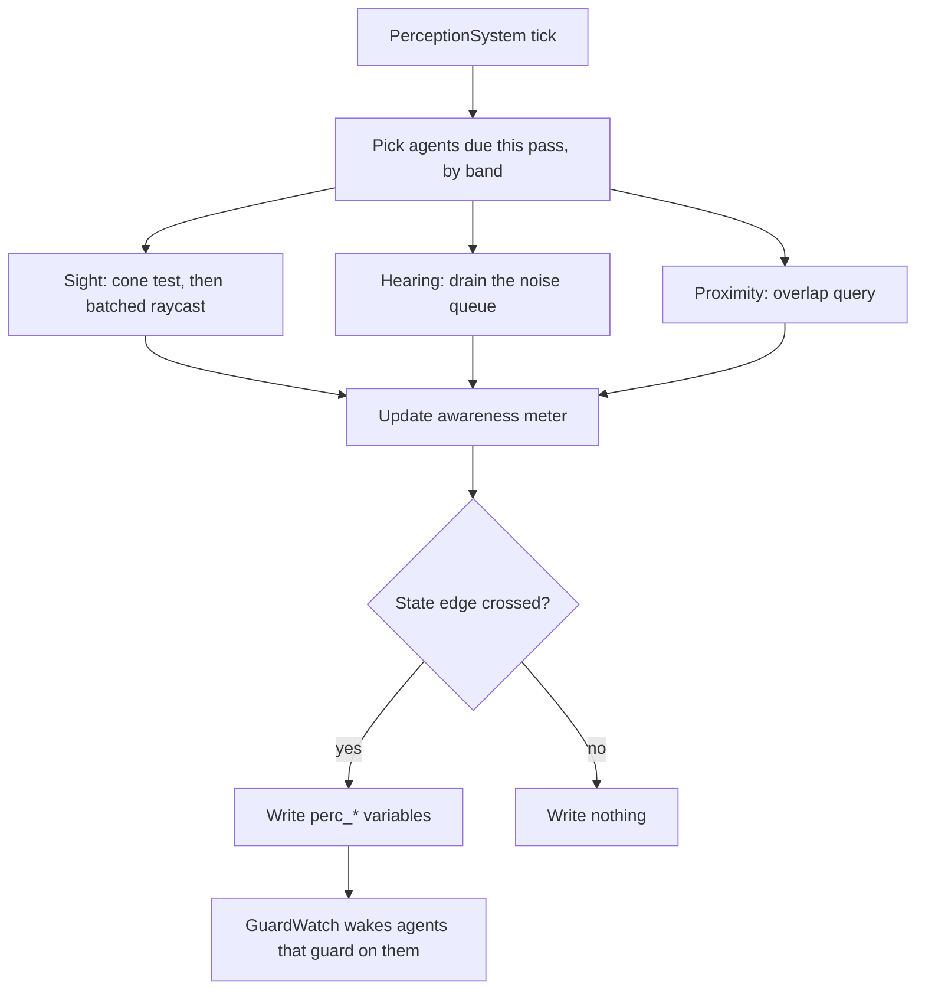

# Perception Params Asset

> **Status:** Built (2026-10-03), not yet compiled or run in a level. This note is the original design; [[Perception]] describes what exists
> **Refines:** [[Perception Module]]
> **Gem:** `Modules/Perception/` (`GOAT_Perception`), see [[Perception]]
> **Asset:** `.prx`, group `GOAT`, shown as "Perception" in the Asset Editor

The asset, sensing, the two components and the blackboard variables exist. What changed from the sketch below:

- Names are `AZStd::string` rather than `AZ::Name`, as `BlackboardVariable` does, and `Validate()` was added.
- Two fields were missing: `m_sightFillPerSecond` and `m_hearingFill`, which say how fast sight and sound fill the meter.
- `m_engageDistance` defaults to 8 m, since 20 m equalled the idle sight range and every sighting would have engaged at once.
- `m_sightMemory` is how long Engaged lasts after the last stimulus, and `m_soundMemory` is how long `perc_heard` stays true.
- `perc_heard` stays true until the sound memory runs out, not for one pass, so a guard on it fires once per burst.
- There is no `profile` field on `GOATAgentComponent`. A separate **GOAT Perception** component holds it, which keeps the core untouched.
- `m_darknessSightScale` is stored but nothing reads it yet, and a blocked line costs the wall cut once however many walls there are.

---

## 🎯 Objective

Let a designer describe **what an agent can sense and how fast it notices** in one data asset, the
way [[BlackboardAsset]] describes variables. Sensing itself runs in C++ for every agent in one
batched pass; the result lands on the blackboard where guards already watch it.

This does not replace the Lua service idea in [[Perception Module]]. A custom sense (a smell trail,
a radar ping) is still a Lua `service`. What changes is that the three common senses stop being
copy-pasted scripts: a Lua service per agent per interval cannot batch its raycasts, and every
agent ends up with its own hand-tuned numbers.

---

## 🗂️ Asset shape

One asset is one **profile**. An agent names the profile it uses (on `GOATAgentComponent`). Two
agents may share one asset.

```cpp
struct SightCone
{
    float m_range = 20.0f;        // metres; 0 turns the sense off in this state
    float m_yawDegrees = 90.0f;   // total horizontal angle, centred on the facing
    float m_pitchDegrees = 60.0f; // total vertical angle
    float m_backOffset = 0.0f;    // cone origin moved this far behind the eyes, so a target
                                  // touching the agent's back is still inside it
};

class PerceptionProfileAsset final : public AZ::Data::AssetData
{
    static constexpr const char* FileExtension = "prx";
    static constexpr const char* AssetGroup = "GOAT";
    static constexpr const char* DisplayName = "Perception";

    // Sight, one cone per awareness state, so an alerted agent can look wider than an idle one.
    SightCone m_idleSight;
    SightCone m_alertSight;
    SightCone m_combatSight;
    float m_darknessSightScale = 1.0f; // multiplies range in dark areas; 1 = unaffected
    AZ::u32 m_sightBlockerMask = 0;    // physics groups that block line of sight

    // Hearing.
    float m_hearingRange = 10.0f;      // loudness-1 sound is heard out to this
    float m_hearingWallCut = 0.0f;     // 0 = walls do not muffle; else distance lost per wall
    float m_hearingMinLoudness = 0.0f; // quieter than this is never heard

    // Proximity sense: notices anything this close regardless of facing or light.
    float m_proximityRange = 1.0f;

    // Awareness meter. Stimulus fills it, silence drains it; the two thresholds are the state edges.
    float m_suspiciousAt = 5.0f;       // Unaware -> Suspicious
    float m_searchingAt = 35.0f;       // Suspicious -> Searching
    float m_engagedAt = 100.0f;        // Searching -> Engaged
    float m_drainPerSecond = 10.0f;
    float m_engageDistance = 20.0f;    // a visible target this close skips straight to Engaged

    // Memory: how long each state survives with no fresh stimulus.
    float m_suspiciousForget = 10.0f;  // seconds
    float m_searchingForget = 16.0f;
    float m_sightMemory = 24.0f;       // last-known position kept this long after losing sight
    float m_soundMemory = 10.0f;

    // Targets.
    AZStd::vector<AZ::Name> m_targetTags; // what counts as something to notice
    float m_damageAwareness = 100.0f;     // awareness added per hit taken from an unseen source

    // Alerting others.
    float m_alertRadius = 0.0f;           // 0 = this agent never calls for help
    AZ::Name m_alertSquad;                // empty = every agent in range, else only this squad
    float m_alertReplyDelay = 0.0f;       // seconds before a helper reacts
    float m_alertReplyJitter = 2.0f;      // random extra, so a pack does not react in lockstep

    // Cost control.
    float m_senseInterval = 0.2f;         // seconds between sight checks at the nearest band
};
```

Everything has a usable default, so a new profile does nothing surprising until it is tuned.

### What each `NpcThinkParam` column became

Read from the Red Wolf of Radagon row; confirm each against the engine's own column documentation
before relying on one.

| `NpcThinkParam` column (value) | Field here | Notes |
| :--- | :--- | :--- |
| `eye_dist` (50), `eye_angY` (90), `eye_angX` (20) | `m_combatSight` / `m_idleSight` | One cone per state instead of one cone plus a separate search cone |
| `searchEye_dist` (15), `searchEye_angY` (50) | `m_alertSight` | The narrower cone used while searching |
| `eye_BackOffsetDist` | `SightCone::m_backOffset` | |
| `ear_dist` (10), `ear_soundcut_dist`, `ear_listenLevel` | `m_hearingRange`, `m_hearingWallCut`, `m_hearingMinLoudness` | |
| `nose_dist` (1) | `m_proximityRange` | Renamed: it is a proximity sense, not literally smell |
| `searchThreshold_Lv0toLv1` (5), `_Lv1toLv2` (35) | `m_suspiciousAt`, `m_searchingAt` | |
| `searchTargetLv1ForgetTime` (10), `_Lv2ForgetTime` (16) | `m_suspiciousForget`, `m_searchingForget` | |
| `SightTargetForgetTime` (24), `SoundTargetForgetTime` (10), `MemoryTargetForgetTime` | `m_sightMemory`, `m_soundMemory` | |
| `BattleStartDist` (20) | `m_engageDistance` | |
| `disableDark` | `m_darknessSightScale` | A flag there, a scale here |
| `callHelp_*`, `platoonReply*` | `m_alertRadius`, `m_alertSquad`, `m_alertReplyDelay`, `m_alertReplyJitter` | Peer IDs there, [[Blackboard System]] squads here |
| `targetSys_DmgEffectRate` (100) | `m_damageAwareness` | |

Deliberately left out because they are not perception: `maxBackhomeDist`, `backhomeDist`,
`BackHome_*`, `nonBattleActLife` (a **leash** concern, better as its own small asset or tree
parameters), the `enableNaviFlg_*` flags (navigation, see [[Navigation]]), the `goalAction_*`,
`soundBehaviorId*`, `weapon*` and animation ids (behaviour and animation, authored in the tree).

---

## 📤 What it writes to the blackboard

The module declares these **agent-scoped** variables itself, the way [[Navigation]] declares
`nav_waypoint`, so no `.bbx` has to mention them.

| Variable | Type | Meaning |
| :--- | :--- | :--- |
| `perc_state` | Int | 0 Unaware, 1 Suspicious, 2 Searching, 3 Engaged |
| `perc_target` | EntityId | The entity the agent is most aware of, or invalid |
| `perc_target_visible` | Bool | True while the target is in sight right now |
| `perc_last_known` | Vector3 | Where the target was last sensed |
| `perc_heard` | Bool | True from a sound until the sound memory runs out |
| `perc_noise_pos` | Vector3 | Where the last heard sound came from |
| `perc_awareness` | Float | The meter, 0 to `m_engagedAt` |

**Writes happen only on change.** Every write to a watched variable wakes the agents that guard on
it ([[GuardWatch]]), so rewriting `perc_awareness` every pass would defeat the whole reactive model.
So the meter is written only when it crosses a state edge, and `perc_target_visible` only when it
flips. A tree that wants the continuous value reads it without a guard; it is then current when the
agent is next awake for another reason.

---

## 🔄 How sensing runs



- **One system, not one script per agent.** It walks the agents due this pass and does the cheap
  cone and distance test first. Only candidates that pass get a raycast, and those go out in one
  batch.
- **Level of detail follows the agent's pacing band** ([[AgentRegistry]]): far agents are sensed
  less often than `m_senseInterval`, and an agent in the manual band is sensed only when ticked.
- **Hearing is event driven.** Gameplay code emits a sound (a footstep, a clash, a shout) on a bus:
  `PerceptionNoiseBus::Broadcast(Emit, position, loudness, sourceEntity, tag)`. The system routes
  each one to agents whose `m_hearingRange` covers it, scaled by loudness and wall loss.
- **Alerting others.** On entering Engaged, an agent with a non-zero `m_alertRadius` writes
  `perc_target` and `perc_state` for nearby agents (or its squad) after their reply delay, subject to
  the helper's own profile.

---

## 🧪 Example

```lua
return tree "GuardAgent" {
    selector {
        sequence {
            condition "perc_target_visible" { abort = "lower_priority" },
            delegate "Combat" { goal = "EngageTarget" },
        },
        sequence {
            condition "perc_heard" { abort = "lower_priority" },
            move_to "perc_noise_pos",
            wait { seconds = 3 },
        },
        script "Patrol",
    },
}
```

Compared with the Lua-service version in [[Perception Module]], the tree is the same. Only where
the numbers live changed.

---

## ❓ Open questions

1. **Inheritance.** Fifty guards that differ in one number should not be fifty copies. A `m_parent`
   profile with "unset" overrides needs an optional wrapper per field; is that worth the Asset
   Editor clutter?
2. **Which raycast.** Scene queries through `AzFramework::Physics` fit most projects, but the module
   should call an interface so a project can supply its own visibility test.
3. **Two targets.** `perc_target` holds one. A boss that tracks two players needs either a ranked
   list or a separate key per squad member.
4. **The leash.** Home distance and return-to-post behaviour deserve their own note rather than
   being squeezed in here.

---

## ✅ Implementation checklist

- [x] `PerceptionProfileAsset` with reflection, a handler, and `.prx` registration like `.bbx`.
- [x] `GOAT_Perception` gem with its own CMake (the `perc_*` variable declarations are still to do).
- [x] Asset Processor builder component, browser icon, `Validate()` and round-trip tests.
- [x] Noise: `EmitNoise` on `GOAT_PerceptionRequestBus`, evaluated when the sound is made.
- [x] Sight, hearing and proximity with throttled writes.
- [x] A profile field, on a separate **GOAT Perception** component rather than `GOATAgentComponent`.
- [x] Tests: cone edges, awareness thresholds, forget times, hearing, the agent senses, write throttling.
- [ ] Tests for the physics world, the system and the components, which need a running level.
- [ ] Darkness.
- [ ] Update [[Perception Module]] to point here and keep the Lua services as the custom-sense path.

---

## 🔗 Related Notes

- [[Perception Module]]
- [[Animation Signal Hook]]
- [[Blackboard System]]
- [[BlackboardAsset]]
- [[GuardWatch]]
- [[Navigation]]

---

*Last updated: 2026-10-03*
